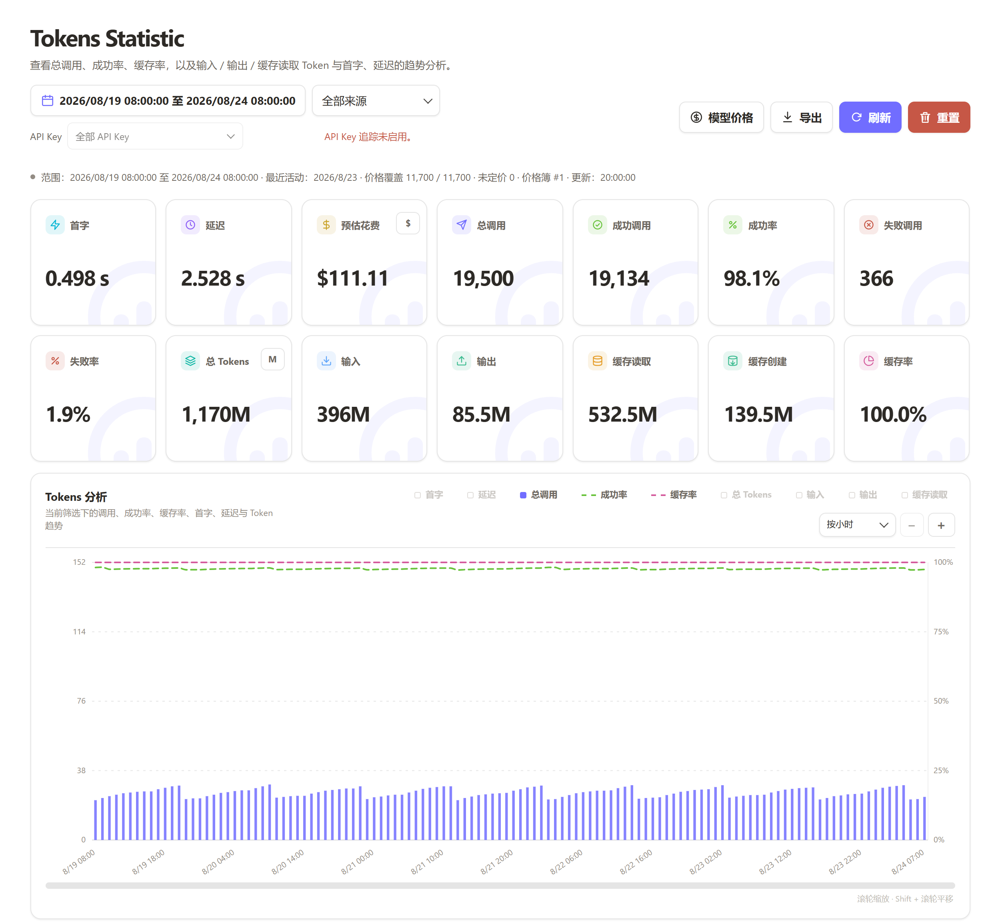
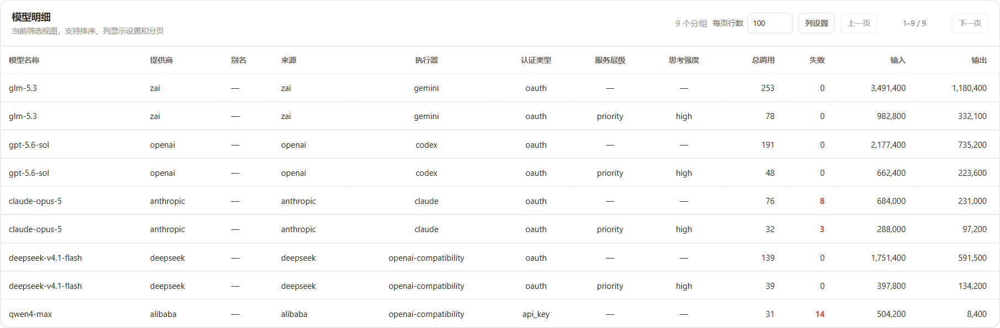
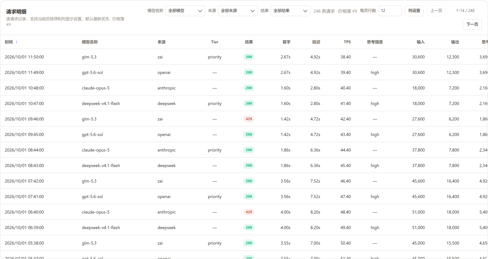
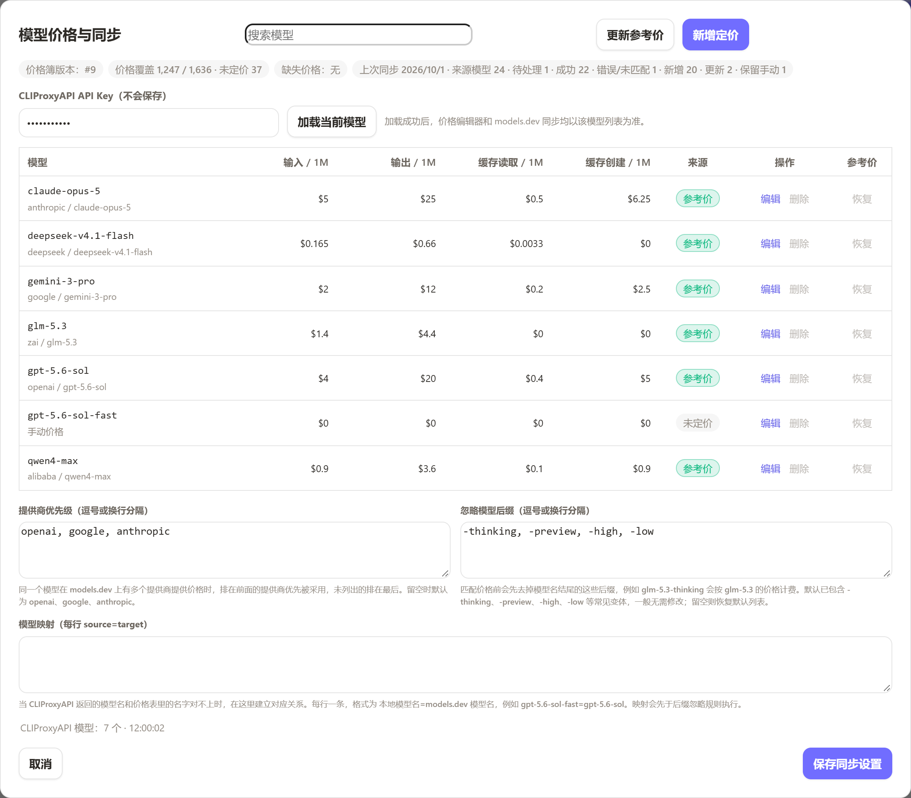

<p align="center"></p>
<h1 align="center">Tokens Statistic</h1>
<p align="center">简体中文 | <a href="README_EN.md">English</a></p>
<p align="center">
  <a href="LICENSE"></a>
  <a href="https://github.com/Pet-Max/cpa-plugin-tokens-statistic/releases/latest"></a>
  <a href="https://go.dev"></a>
  <a href="https://github.com/Pet-Max/cpa-plugin-tokens-statistic/releases/latest"></a>
</p>


Tokens Statistic 是一个 [CLIProxyAPI](https://github.com/router-for-me/CLIProxyAPI) 用量统计插件。安装后，管理中心会新增「Tokens Statistic」页面，每次模型调用的模型、Token 数、延迟、成败与缓存命中都会被记录，并以趋势图和明细表呈现，支持任意时间范围查询。所有数据保存在本地数据库，不上传。

## 界面预览

**仪表盘总览**



| 模型明细 | 请求明细 |
|:-:|:-:|
|  |  |

**模型价格与同步**



## 主要功能

- 记录每次调用的模型、输入 / 输出 / 推理 / 缓存 Token、延迟、TTFT、TPS、成败与缓存命中
- 按模型、提供商、执行器、来源、认证类型、服务层级、推理强度、失败状态多维分组统计
- 概览卡片、Tokens 分析趋势图、维度统计表与逐请求明细表
- 时间范围支持今天、最近 5 小时 / 7 天 / 30 天、本月及自定义区间
- 趋势图支持分钟至月聚合，滚轮缩放与平移
- 表格分页、排序、列显示偏好持久化
- 支持按 API Key 多选筛选（并集）与标签管理
- Token 单位完整值 / K / M / B 切换并持久化
- 预估花费￥与$切换并持久化
- 跟随管理中心主题与浏览器语言，内置简体中文、繁体中文、英文、俄文
- 单文件插件，支持Linux、Mac与Windows

## 部署

### 方法1（推荐）：

可以直接在 CPA 插件管理商店内一键安装。

### 方法2：

1. 从 [Releases](https://github.com/Pet-Max/cpa-plugin-tokens-statistic/releases) 下载对应平台的 zip 并解压，得到一个动态库文件。
2. 将动态库文件放入 CLIProxyAPI 目录下的 `plugins/<系统>/<架构>/`。
3. 在 CLIProxyAPI 的 config.yaml 中配置：

```yaml
plugins:
  enabled: true
  configs:
    tokens-statistic:
      enabled: true     # 必填：宿主默认不加载未显式启用的插件
      db: data/tokens-statistic.db   # 数据库路径（相对 CLIProxyAPI 工作目录）；省略时默认 <CLIProxyAPI 目录>/data/tokens-statistic.db
      retention: 365    # 逐分钟聚合与请求明细的保留天数（1–3650），默认 365
      flush: 5s         # 批量写盘间隔（1s–1h）。小主机（NAS/SD 卡等写入敏感设备）推荐值；省略此行 = 每条请求立即落库（默认）
      secret: "123456"  # API Key 加密密钥。123456 即默认值，仅建议本机测试；公开部署须改为不少于 32 字节的随机串
```

4. 字段说明：

| 字段 | 默认值 | 说明 |
|---|---|---|
| `db` | `<CLIProxyAPI 目录>/data/tokens-statistic.db` | bbolt 数据库路径。留空使用默认位置；填相对路径时相对于 CLIProxyAPI 工作目录解析 |
| `retention` | `365` | 逐分钟聚合与请求明细的保留天数（1–3650），过期自动清理 |
| `flush` | 空 | 留空表示每条请求立即落库；填写后按间隔批量写盘（1s–1h）。小主机或高频调用建议 5s；突发流量由内部 100 条/批上限自动摊平 |
| `secret` | `123456` | API Key 加密与指纹密钥，自定义须不少于 32 字节。公开部署必须修改；留空则完全禁用 API Key 追踪 |

## 构建

构建分两条路：**本地构建**给自己测试看，**CI 发布构建**对外发版。

| | 本地构建 | CI 发布构建 |
|:--|:--|:--|
| 平台 | 4 个（Windows、Linux × amd64/arm64） | 6 个（再加上 macOS amd64/arm64） |
| 怎么触发 | 手动跑 `scripts/` 里的脚本 | 推送 `v*` 标签后自动执行 |
| 产物去向 | 留在本机 `dist/`，不进 git、不上传 | 自动挂到 GitHub Release |
| 用途 | 本机验证、真机冒烟测试 | 正式发布，供用户下载 |

### 本地构建（4 平台，用于本地测试）

环境要求：Go 1.26+、`CGO_ENABLED=1`；交叉编译推荐 [zig](https://zig.dev)，Windows 也可用 MinGW-w64，Linux arm64 也可用 aarch64-linux-gnu-gcc。

| 平台 | 命令 |
|:--|:--|
| Linux amd64 | `bash scripts/build-linux-amd64.sh` |
| Linux arm64 | `bash scripts/build-linux-arm64.sh` |
| Windows amd64 / arm64 | `powershell -ExecutionPolicy Bypass -File scripts/build_dll.ps1` |

也可以直接用 go build（以 Linux amd64 为例）：

```bash
CGO_ENABLED=1 GOOS=linux GOARCH=amd64 \
  CC="zig cc -target x86_64-linux-gnu" \
  go build -buildmode=c-shared -trimpath -buildvcs=false \
  -ldflags="-s -w -X github.com/Pet-Max/cpa-plugin-tokens-statistic/internal/plugin.version=v0.1.4" \
  -o tokens-statistic.so .
```

产物位置：

- 原始动态库输出到 `dist/`；
- 商店规格发布包（`tokens-statistic_<版本>_<平台>.zip` + `checksums.txt`）统一输出到 `dist/release/v<版本>/`，与 CI 发行的 Release 资产同规格；
- 版本通过 `VERSION` 覆盖，例如 `VERSION=v0.2.0 bash scripts/build-linux-amd64.sh`。

测试：

```bash
gofmt -w *.go
go vet ./...
go test -count=1 ./...
```

浏览器回归测试（可选）：需要 Node、Chrome/Edge 与 `npm ci` 安装的 playwright-core，并设置 `CHROME_PATH` 指向浏览器；条件不满足时相关用例自动跳过。

### CI 发布构建（6 平台，推送标签自动发布）

推送 `v*` 标签后，CI 会自动在 GitHub 的构建服务器上完成全部六个平台的编译，自动生成 checksums.txt 并创建 Release。

## 隐私与安全

- 不存储 prompt、请求正文与响应正文，只保留统计所需的元数据与计数
- API Key 以密文加指纹形式存储，明文仅在通过管理密钥验证的管理接口中按需返回，不写入页面静态内容、日志或浏览器存储
- 仪表盘数据与全部管理操作都受 CLIProxyAPI 管理密钥保护：在管理中心内打开自动复用已登录身份，独立访问时需输入一次管理密钥（仅保存在当前标签页，关闭即失效）
- 默认 `secret`（123456）仅适用于本机测试；公开部署请设置不少于 32 字节的随机值。更换 `secret` 后历史密文保留但无法解密显示
- 留空 `secret` 可完全关闭 API Key 追踪

## 鸣谢

[AITNR](https://github.com/AITNR/cap-token-usage-tracker)

## License

[MIT](LICENSE)
